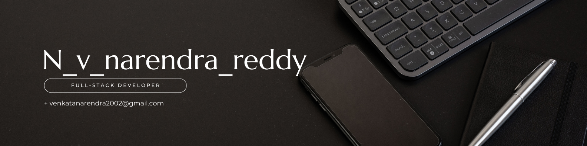

<h1 align="left">👋 Hi, I'm Venkata Narendra Reddy </h1>
<h3 align="center"> 
  
</h3>

- 👨‍💻 Passionate MERN Stack Developer from India.
- 🚀 Skilled in **MongoDB, Express.js, React.js, Node.js, and React Native**.
- 📫 Reach me at: [narendra.narigammagari@gmail.com](mailto:narendra.narigammagari@gmail.com)
- 🌐 Portfolio: [nvnr-2.netlify.app](https://nvnr-2.netlify.app/)
- 💡 Projects include **Interior Design Platform, Smart Recipe Recommender, Farmers Marketplace, Food Delivery App** and more!
- 🏆 Achievements: Hackathon winner, MongoDB Certified (Top 10%), and solved 500+ problems on CodeChef.
- 🔗 Let’s connect on [LinkedIn](https://linkedin.com/in/venkat-naredra-reddy-646307249)!

---

<h3 align="left">📲 Connect with me:</h3>

  
  
  
  

---

<h3 align="left">🚀 Tech Stack:</h3>

---

<h3 align="left">📊 GitHub Activity:</h3>
<table>
  <tr>
    <td></td>
    <td></td>
  </tr>
</table>

---

<!-- Proudly created with GPRM ( https://gprm.itsvg.in ) -->
